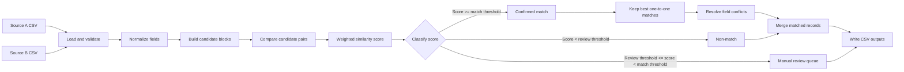
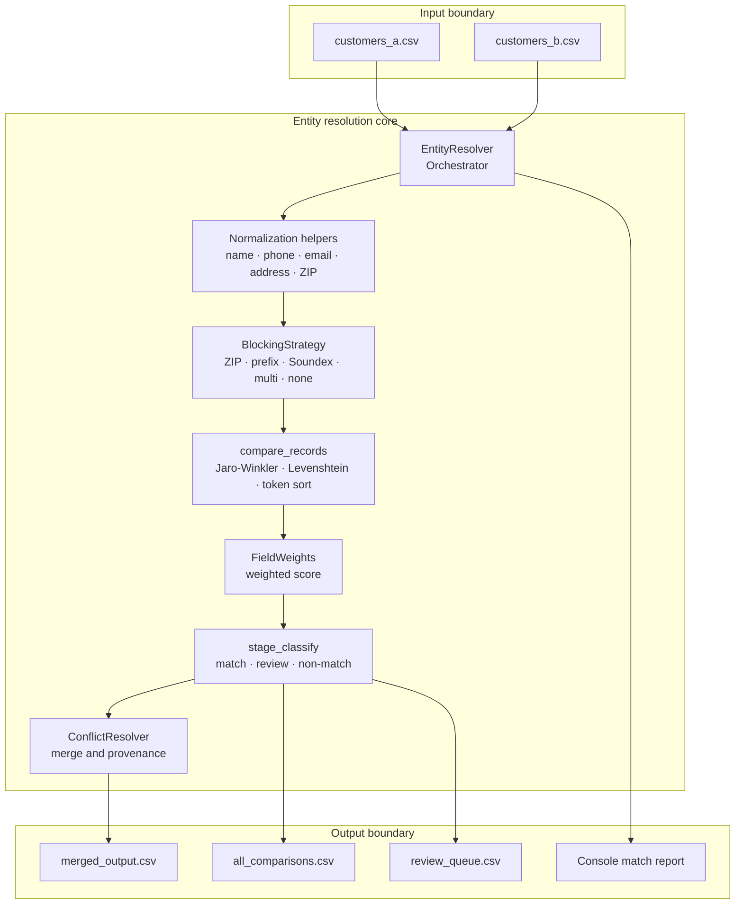

<div align="center">

# Entity Resolution System

**A practical, explainable pipeline for matching, deduplicating, and merging customer records across independent datasets.**

[](https://www.python.org/)
[](https://pandas.pydata.org/)
[](https://numpy.org/)
[](https://github.com/rapidfuzz/RapidFuzz)
[](https://en.wikipedia.org/wiki/Comma-separated_values)
[]

</div>

---

## Overview

Entity resolution is the process of determining when records from different sources refer to the same real-world entity. This project provides a transparent, configurable customer-record matching pipeline that combines **field normalization**, **candidate blocking**, **fuzzy similarity scoring**, **match classification**, and **conflict-aware merging**.

It is designed for batch CSV workflows where records may contain spelling differences, formatting inconsistencies, missing values, swapped names, alternate phone formats, or abbreviated addresses. Every comparison retains field-level scores and a final decision, making the output suitable for both automated processing and human review.

## Why this project

A naïve comparison of two datasets with `n` and `m` records requires `n × m` pair evaluations. The resolver reduces this search space with configurable blocking strategies before applying the more expensive fuzzy comparison stage. This makes the matching process more practical while preserving an auditable trail of candidate pairs and decisions.

## Key capabilities

| Capability | What it does |
| --- | --- |
| **Field normalization** | Standardizes names, email addresses, phone numbers, ZIP codes, and street addresses before comparison. |
| **Candidate blocking** | Supports `multi`, `zip`, `name_prefix`, `soundex`, and `none` strategies to reduce unnecessary comparisons. |
| **Fuzzy matching** | Uses Jaro–Winkler for names, Levenshtein-style similarity for general strings, and token-sort similarity for addresses and email local parts. |
| **Weighted scoring** | Combines eight field scores into a single explainable score using configurable field weights. |
| **Three-way classification** | Labels each pair as `match`, `review`, or `non-match` using configurable thresholds. |
| **One-to-one deduplication** | Keeps the highest-scoring match per record from each source. |
| **Conflict resolution** | Produces a merged record using non-null and longer-value preferences, with source provenance retained. |
| **Operational reporting** | Reports block counts, candidate reduction, match counts, review counts, merged records, and comparison time. |
| **Fallback backend** | Uses a pure-Python `difflib` fallback when RapidFuzz is unavailable. |

## Technology stack

<div align="center">

| Layer | Technology |
| --- | --- |
| Runtime |  |
| Data processing |   |
| Similarity engine |  with `difflib` fallback |
| Data exchange |  |
| Documentation |   |

</div>

## Workflow

The pipeline follows a clear sequence from raw input records to a merged, reviewable output. Blocking happens before fuzzy comparison so that expensive scoring is focused on plausible candidates.



### Processing stages

1. **Load:** Both CSV files are read as strings and missing values are filled with empty strings.
2. **Normalize:** Comparison values are standardized without mutating the original input files. Names are lowercased and cleaned, phone numbers are reduced to digits, email addresses are lowercased, ZIP codes are truncated to five characters, and common street abbreviations are expanded.
3. **Block:** Records are assigned to candidate groups using ZIP code, name prefix, Soundex, or a composite ZIP-plus-Soundex key.
4. **Compare:** Candidate pairs receive field-level similarity scores across names, email, phone, address, city, state, and ZIP code.
5. **Classify:** The weighted overall score becomes a `match`, `review`, or `non-match` decision.
6. **Deduplicate:** Confirmed matches are sorted by score and reduced to one best match per record in each source.
7. **Merge:** Matched records are combined; records unique to either source are retained, and provenance fields are added.
8. **Export:** The merged table, complete comparison matrix, and review queue are written as CSV files.

## Architecture



## Matching model

The final score is an explainable weighted sum of field-level similarities. The default weights emphasize the last name, email address, phone number, and first name while allowing supporting evidence from address, city, state, and ZIP code.

| Field | Default weight | Comparison approach |
| --- | ---: | --- |
| First name | `0.15` | Jaro–Winkler |
| Last name | `0.25` | Jaro–Winkler |
| Email | `0.20` | Exact match, Levenshtein, and local-part token similarity |
| Phone | `0.20` | Exact match, local-number match, or string similarity |
| Address | `0.10` | Token-sort similarity after abbreviation expansion |
| City | `0.05` | Jaro–Winkler |
| State | `0.03` | Exact normalized comparison |
| ZIP code | `0.02` | Exact or string similarity |

The weighted score is interpreted using two thresholds. The executable sample configuration uses a **match threshold of `0.70`** and a **review threshold of `0.50`**; the reusable `EntityResolver` constructor defaults to `0.75` and `0.55`, respectively.

## Getting started

### 1. Install dependencies

```bash
python -m pip install pandas numpy rapidfuzz
```

RapidFuzz is the preferred similarity backend. If it is not installed, the module falls back to Python's standard-library `difflib` implementation for core string comparisons.

### 2. Prepare input files

Place two CSV files in the repository root:

```text
customers_a.csv
customers_b.csv
```

The resolver expects a compatible customer schema containing the following logical fields:

```text
id, first_name, last_name, email, phone, address, city, state, zip
```

### 3. Run the sample pipeline

```bash
python entity_resolution.py
```

The script loads both inputs, creates multi-block candidates, compares and classifies records, prints a match report, and writes the output files to `./output/`.

### 4. Use the resolver as a Python module

```python
from entity_resolution import EntityResolver

resolver = EntityResolver(
    path_a="customers_a.csv",
    path_b="customers_b.csv",
    match_threshold=0.70,
    review_threshold=0.50,
    blocking_strategy="multi",
    verbose=True,
)

results = resolver.run()
resolver.print_report()
resolver.save_outputs(output_dir="output")

merged = results["merged"]
review_queue = results["review"]
statistics = results["stats"]
```

## Blocking strategies

Blocking determines which record pairs are eligible for fuzzy comparison. Use a more selective strategy for larger datasets, and use `none` when recall is more important than runtime or when the inputs are already small.

| Strategy | Block key | Best suited for |
| --- | --- | --- |
| `multi` | Five-digit ZIP plus Soundex of last name | General-purpose matching with good candidate reduction |
| `zip` | Five-digit ZIP code | Datasets with reliable geographic fields |
| `name_prefix` | First three normalized characters of last name | Data with reasonably stable surnames |
| `soundex` | Phonetic last-name code | Misspellings and phonetic variations |
| `none` | One global block | Small datasets or maximum candidate recall |

## Output files

| File | Description |
| --- | --- |
| `output/merged_output.csv` | De-duplicated master table containing matched records and records unique to either source. |
| `output/all_comparisons.csv` | Every candidate pair, its block, field-level scores, overall score, and classification. |
| `output/review_queue.csv` | Candidate pairs whose scores fall between the review and match thresholds. |

Merged records include `source_id_a`, `source_id_b`, `match_score`, and `merge_decision` provenance fields. The merge decision is one of `matched`, `unique_a`, or `unique_b`.

## Repository structure

```text
.
├── entity_resolution.py   # Normalization, blocking, scoring, classification, and merging
├── customers_a.csv        # User-provided source dataset A
├── customers_b.csv        # User-provided source dataset B
├── output/                # Generated CSV results (created at runtime)
├── .gitignore
└── README.md
```

## Design notes and limitations

This implementation intentionally favors explainability over opaque model complexity. It does not require labeled training data, a database, an external service, or a separate application server. Thresholds and field weights should be calibrated against representative data for each domain, especially when source quality, language, geography, or customer identifiers differ.

Blocking can improve performance substantially, but every blocking strategy trades recall for speed. A record with a changed ZIP code and a strongly misspelled surname may not enter the same candidate block as its counterpart. For high-stakes workflows, compare multiple blocking strategies, inspect the review queue, and validate the resulting matches with domain-specific quality checks.

## License

This project is released under the MIT License.

---

<div align="center">

Built for transparent, reproducible customer data deduplication.

</div>
